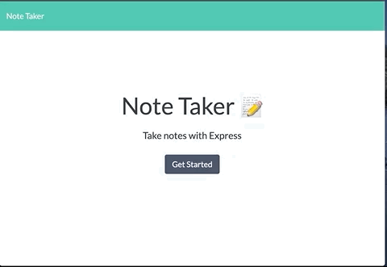

# Note Taker Application

  ## Description
  
  This project is an application that can be used to write, save and delete notes. This application uses express backend to save and retrieve note data from a JSON file. 

  ## User Story

 ```
AS A user, I want to be able to write and save notes

I WANT to be able to delete notes I've written before

SO THAT I can organize my thoughts and keep track of tasks I need to complete
 ```

  ## Table Of Contents
  
  * [Deployment](#deployment)

  * [Demo of Application](#demo-of-application)
  
  * [Questions](#questions)
  
  ## Deployment

  Visit the following link for deployed application:

  [Note Taker Application](https://ancient-lake-90836.herokuapp.com/)


  ## Demo of Application

  

  ## Questions
  
  If you have any questions about this project, please contact ashleydeyoung at ashley.d.deyoung@gmail.com.